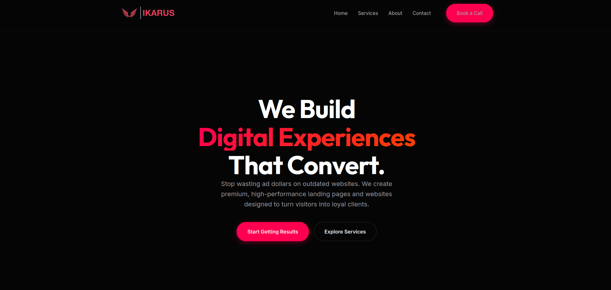
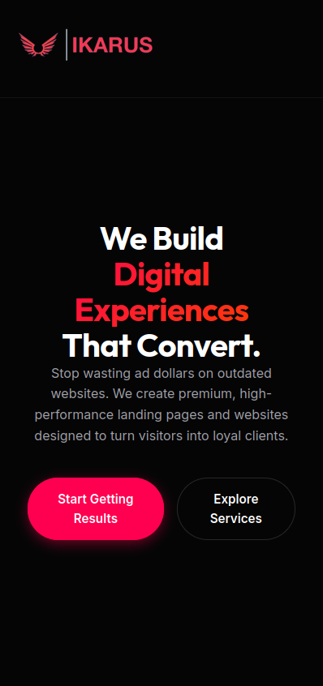

<h1 align="center">Ikarus Agency</h1>

The first "real" website I built, made for a web development agency my friends and I briefly ran. We soon went our separate ways due to different career interests, but the site remains part of my portfolio.

## Links

- [Repo](https://github.com/marinsabo/Ikarus-Agency "Ikarus Agency Repo")
- [Live](https://marinsabo.github.io/Ikarus-Agency/ "Live View")

## Screenshots

## Built With

- HTML5
- CSS3

## AI Usage

I didn't use any AI in this project. Some parts of the website were written by other team members, so I can't speak to whether AI was used there.
